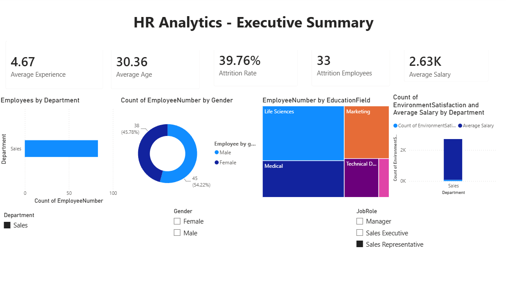
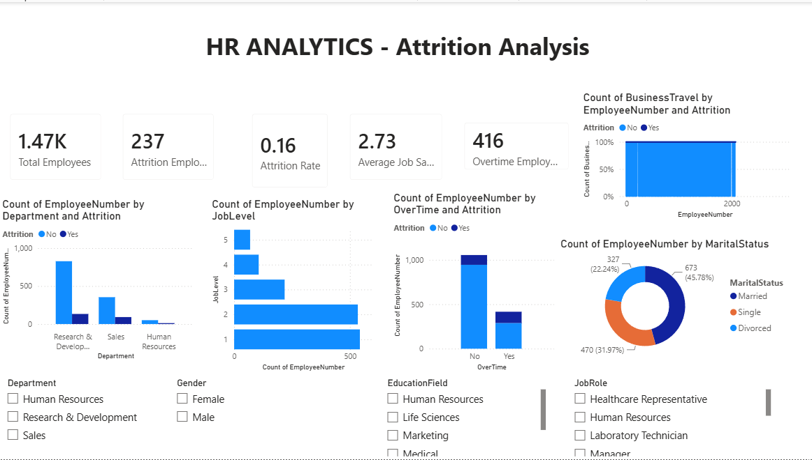
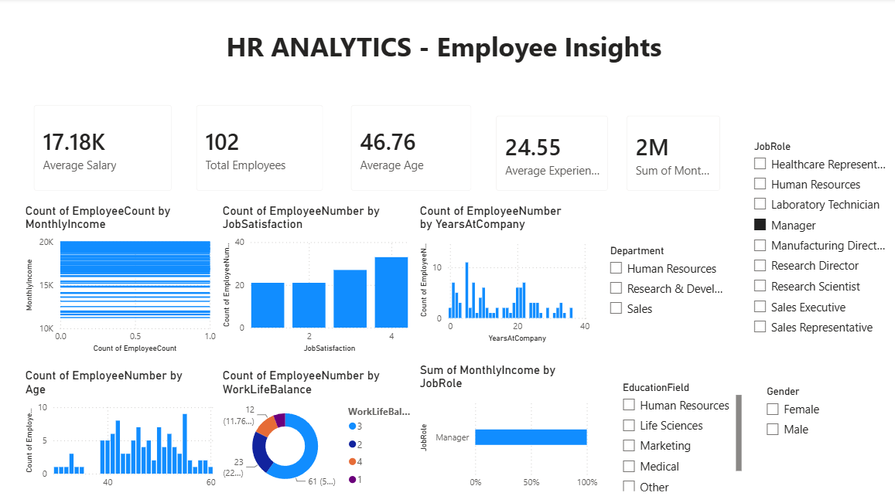

# HR-Employee-Analytics
## Problem Statement
Employee attrition is one of the biggest challenges faced by organizations. High employee turnover increases recruitment costs, reduces productivity, affects employee morale, and results in the loss of experienced talent.
The HR department wants to answer the following questions:
- Which departments have the highest employee attrition?
- Which job roles are more likely to experience attrition?
- Does overtime contribute to employees leaving the organization?
- How do salary, experience, age, and job satisfaction affect attrition?
- Can employee attrition be predicted using Machine Learning?
- What business recommendations can reduce employee turnover?
The objective of this project is to analyze historical HR data to identify the key factors influencing employee attrition and provide actionable insights that can help HR teams improve employee retention.
Using SQL, Python, Statistics, Machine Learning, and Power BI, this project performs end-to-end HR analytics, starting from data extraction and exploration to predictive modeling and interactive dashboard development.

## Project Objectives
The primary objective of this project is to perform end-to-end HR analytics to understand employee attrition and provide data-driven insights for better workforce management.
The project aims to:

- Analyze employee demographics, job roles, and workforce distribution.
- Identify the key factors influencing employee attrition.
- Perform exploratory data analysis (EDA) to discover trends and patterns.
- Validate business assumptions using statistical techniques such as descriptive statistics and hypothesis testing.
- Build a Logistic Regression model to predict employee attrition.
- Evaluate the model using Accuracy, Precision, Recall, and F1-Score.
- Develop interactive Power BI dashboards for HR reporting and decision-making.
- Provide actionable business recommendations to improve employee retention and reduce employee turnover.

##  Tech Stack

| Category | Tools & Technologies |
|----------|----------------------|
| Programming Language | Python |
| Database | MySQL |
| Query Language | SQL |
| Data Analysis | Pandas, NumPy |
| Data Visualization | Matplotlib, Seaborn |
| Statistical Analysis | Descriptive Statistics, Correlation Analysis, Hypothesis Testing (t-Test, Chi-Square Test, ANOVA) |
| Machine Learning | Scikit-learn (Logistic Regression) |
| Business Intelligence | Power BI |
| Development Environment | Jupyter Notebook, VS Code |
| Version Control | Git, GitHub |


## Project Workflow

The project follows a structured data analytics workflow, starting from understanding the business problem to delivering actionable insights through dashboards and predictive analytics.

### 1. Business Understanding
- Defined the business problem of employee attrition.
- Identified key business questions for the HR department.

### 2. Data Collection
- Used the IBM HR Employee Attrition dataset.
- Imported the dataset into MySQL and Python for analysis.
- 
### 3. Data Analysis using SQL and Python
The HR dataset was analyzed using both SQL and Python.
- **SQL** was used for querying, filtering, aggregating, and answering business questions directly from the database.
- **Python** was used for data cleaning, exploratory data analysis (EDA), visualization, statistical analysis, hypothesis testing, and machine learning.
Using both technologies ensured efficient data extraction as well as deeper analytical and predictive insights.

### 4. Statistical Analysis
- Calculated descriptive statistics (mean, median, standard deviation).
- Performed correlation analysis.
- Applied hypothesis testing using:
  - Independent t-Test
  - Chi-Square Test
  - One-Way ANOVA

### 5. Machine Learning
- Preprocessed the data using encoding and train-test split.
- Built a Logistic Regression model to predict employee attrition.
- Evaluated the model using:
  - Accuracy
  - Precision
  - Recall
  - F1-Score

### 6. Business Intelligence
- Developed interactive Power BI dashboards for:
  - Executive Summary
  - Attrition Analysis
  - Employee Insights

### 7. Business Recommendations
- Identified key factors influencing employee attrition.
- Proposed data-driven recommendations to improve employee retention.


## Dataset Description

This project uses the **IBM HR Analytics Employee Attrition & Performance** dataset, which contains information about employees, including their demographic details, job-related attributes, compensation, performance, and attrition status.

### Dataset Information

- **Source:** IBM HR Analytics Employee Attrition & Performance Dataset
- **Total Records:** 1,470 employees
- **Total Features:** 35 columns
- **Target Variable:** `Attrition` (Yes/No)

### Key Features
| Category | Features |
|----------|----------|
| Employee Information | Age, Gender, MaritalStatus, Education, EducationField |
| Job Information | Department, JobRole, JobLevel, BusinessTravel |
| Compensation | MonthlyIncome, DailyRate, HourlyRate, StockOptionLevel |
| Experience | TotalWorkingYears, YearsAtCompany, YearsInCurrentRole, YearsSinceLastPromotion |
| Employee Satisfaction | JobSatisfaction, EnvironmentSatisfaction, RelationshipSatisfaction, WorkLifeBalance |
| Performance | PerformanceRating, TrainingTimesLastYear, JobInvolvement |
| Target Variable | Attrition |

### Business Goal
The objective is to analyze employee-related factors and determine the major contributors to employee attrition. The insights obtained from this analysis can help HR teams design effective employee retention strategies and improve overall workforce management.

## SQL Analysis
The HR dataset was analyzed using **both SQL and Python**, following an industry-style analytics workflow.
SQL was primarily used to query, filter, aggregate, and summarize data stored in the database, enabling efficient exploration of workforce information before performing advanced analytics in Python.
### SQL Concepts Applied

- Data Retrieval (`SELECT`)
- Filtering (`WHERE`)
- Sorting (`ORDER BY`)
- Aggregation (`COUNT`, `SUM`, `AVG`, `MIN`, `MAX`)
- Grouping (`GROUP BY`, `HAVING`)
- Joins (`INNER JOIN`)
- Subqueries
- Common Table Expressions (CTEs)
- Window Functions (`RANK()`, `DENSE_RANK()`, `ROW_NUMBER()`)

### Role of SQL in the Project
SQL was used to efficiently extract, summarize, and validate business insights directly from the database. These insights were later verified and explored in greater detail using Python through statistical analysis, data visualization, and machine learning.


##  Python Analysis

After the initial analysis using SQL, Python was used to perform comprehensive data analysis, visualization, statistical validation, and predictive modeling.
Python provided greater flexibility for exploring relationships between variables, identifying patterns, testing business hypotheses, and building a machine learning model for employee attrition prediction.

### Data Analysis Workflow
#### Data Loading
- Imported the HR dataset using Pandas.
- Explored the dataset structure, data types, and summary information.

#### Data Cleaning
- Checked for missing values.
- Verified duplicate records.
- Validated data quality before analysis.

#### Exploratory Data Analysis (EDA)
- Analyzed employee demographics.
- Explored department-wise and job role-wise employee distribution.
- Examined salary, experience, and age distributions.
- Investigated relationships between overtime, job satisfaction, work-life balance, and employee attrition.

#### Data Visualization
Created informative visualizations using Matplotlib and Seaborn, including:
- Count Plots
- Bar Charts
- Box Plots
- Correlation Heatmap
- Pie Charts

These visualizations helped identify workforce patterns and potential factors contributing to employee attrition.
### Outcome
Python enabled detailed exploratory analysis, allowing deeper investigation into employee behavior and supporting the statistical analysis and machine learning stages of the project.


## Project Structure

```
HR-Employee-Analytics/
│
├── dashboard/
│   ├── Dashboard1.png
│   ├── Dashboard2.png
│   └── Dashboard3.png
│
├── data/
│   └── WA_Fn-UseC_-HR-Employee-Attrition.csv
│
├── models/
│   └── employee_attrition_model.pkl
│
├── notebooks/
│   └── HR_Analytics.ipynb  
│
├── sql/
│   ├── 01_Basic_Queries.sql
│   ├── 02_Aggregation_Queries.sql
│   ├── 03_Intermediate_Queries.sql
│   ├── 04_Window_Functions.sql
│   └── 05_Business_Case_Queries.sql
│
├── README.md
├── requirements.txt
└── .gitignore
```

## Power BI Dashboard Preview

### Dashboard 1 – Executive Summary



---

### Dashboard 2 – Attrition Analysis



---

### Dashboard 3 – Employee Insights



## Statistical Analysis
To validate the insights obtained from exploratory data analysis, statistical techniques were applied to determine whether observed patterns were statistically significant rather than occurring by chance.

### Descriptive Statistics
Descriptive statistics were used to summarize the overall characteristics of the workforce, including:
- Mean
- Median
- Mode
- Standard Deviation
- Minimum and Maximum values
- Quartiles

These measures helped understand employee demographics, salary distribution, experience levels, and other key workforce characteristics.

### Correlation Analysis
A correlation matrix and heatmap were generated to examine the relationships between numerical variables such as age, monthly income, total working years, job level, and years at the company.
This analysis helped identify positive and negative relationships among employee attributes.

### Hypothesis Testing
Statistical hypothesis tests were performed to validate business assumptions.

#### Independent t-Test
- Compared the average monthly income of employees who stayed versus those who left the organization.
- Determined whether the difference in average income between the two groups was statistically significant.

#### Chi-Square Test
- Examined the relationship between categorical variables such as Overtime and Attrition.
- Determined whether employee attrition was associated with overtime.

#### One-Way ANOVA
- Compared the average monthly income across different departments.
- Determined whether salary differences among departments were statistically significant.

### Outcome
The statistical analysis provided evidence-based validation of business insights obtained during exploratory data analysis, increasing confidence in the conclusions before developing the machine learning model.


## Machine Learning
To predict employee attrition, a **Logistic Regression** classification model was developed using Scikit-learn. Logistic Regression was selected because the target variable (`Attrition`) is binary (`Yes`/`No`), making it a suitable and interpretable algorithm for classification.

### Data Preprocessing
Before training the model, the dataset was prepared by:
- Handling categorical variables using label encoding.
- Selecting relevant features for prediction.
- Splitting the dataset into training and testing sets.
- Scaling numerical features where required.

### Model Development
A Logistic Regression model was trained to classify whether an employee is likely to leave the organization based on demographic, compensation, experience, and job-related attributes.

### Model Evaluation
The performance of the model was evaluated using the following metrics:
- Accuracy
- Precision
- Recall
- F1-Score
- Confusion Matrix
These metrics were used to assess the model's ability to correctly identify employees who are likely to leave while minimizing incorrect predictions.

### Business Value
The predictive model helps HR teams proactively identify employees who may be at risk of attrition. This enables organizations to implement targeted retention strategies, improve employee satisfaction, and reduce turnover costs.


##  Power BI Dashboards

Interactive Power BI dashboards were developed to transform analytical findings into meaningful business insights. These dashboards enable HR managers to monitor workforce trends, analyze employee attrition, and support data-driven decision-making.

### Dashboard 1: Executive Summary

**Objective:**
Provide a high-level overview of the organization's workforce.

**Key KPIs**
- Total Employees
- Attrition Rate
- Average Salary
- Average Age
- Average Experience

**Visualizations**
- Employees by Department
- Employees by Gender
- Employees by Education Field
- Department-wise Workforce Distribution

**Business Value**
This dashboard provides HR executives with a quick snapshot of workforce composition and overall organizational health.

---

### Dashboard 2: Attrition Analysis

**Objective:**
Identify the major factors contributing to employee attrition.

**Key Visualizations**
- Attrition by Department
- Attrition by Job Role
- Attrition by Overtime
- Attrition by Business Travel
- Attrition by Age Group
- Attrition by Marital Status

**Business Value**
This dashboard helps HR identify high-risk employee groups and understand the factors associated with employee turnover.

---

### Dashboard 3: Employee Insights
**Objective:**
Analyze employee demographics, compensation, satisfaction, and experience.

**Key Visualizations**
- Salary Distribution
- Age Distribution
- Job Satisfaction Analysis
- Work-Life Balance Distribution
- Years at Company
- Average Salary by Job Role

**Business Value**
This dashboard provides detailed insights into workforce characteristics, helping HR understand employee profiles and identify opportunities to improve employee engagement and retention.
### Dashboard Features
- Interactive slicers for dynamic filtering
- Cross-filtering between visuals
- Executive-level KPI cards
- Interactive charts and graphs
- User-friendly dashboard design


## Key Business Insights

Based on SQL analysis, exploratory data analysis, statistical testing, machine learning, and Power BI dashboards, the following key insights were identified:
- Employee attrition was higher in specific departments and job roles, indicating uneven workforce retention across the organization.
- Employees working overtime showed a stronger association with attrition compared to employees who did not work overtime.
- Monthly income and total working years exhibited meaningful relationships with employee attrition and employee experience.
- Job satisfaction and work-life balance were important factors influencing employee retention.
- Salary distribution varied significantly across departments and job roles.
- Statistical hypothesis testing validated several observed patterns, providing confidence that key findings were not due to random variation.
- The Logistic Regression model successfully predicted employee attrition and can be used as an early warning system for identifying employees at risk of leaving.
- Interactive Power BI dashboards enabled HR managers to monitor workforce trends and analyze employee attrition through dynamic visualizations.


## Business Recommendations
Based on the analytical findings, the following recommendations can help improve employee retention and workforce management:
1. **Reduce Employee Overtime**
   - Monitor employees with excessive overtime and implement workload balancing strategies to reduce burnout and improve work-life balance.
2. **Improve Employee Engagement**
   - Conduct regular employee feedback sessions and engagement surveys to identify concerns before they lead to attrition.
3. **Review Compensation Strategies**
   - Evaluate salary structures and ensure competitive compensation, especially for job roles and departments with higher attrition rates.
4. **Enhance Career Development Programs**
   - Provide clear career progression opportunities, mentorship programs, and continuous learning initiatives to increase employee satisfaction.
5. **Strengthen Work-Life Balance**
   - Introduce flexible work policies and wellness programs to improve employee well-being and job satisfaction.
6. **Implement Predictive HR Analytics**
   - Utilize the Logistic Regression model to identify employees at higher risk of attrition and proactively implement retention strategies.
7. **Develop Department-Specific Retention Plans**
   - Focus HR initiatives on departments and job roles with higher turnover by addressing their unique challenges and workforce needs.
8. **Monitor HR KPIs Continuously**
   - Use interactive Power BI dashboards to track attrition trends, workforce demographics, employee satisfaction, and other key HR metrics for informed decision  making.


## Learning Outcomes
This project strengthened my understanding of the complete data analytics lifecycle by integrating multiple technologies and analytical techniques to solve a real-world business problem.
Through this project, I gained practical experience in:
- Writing SQL queries to retrieve, filter, aggregate, and analyze business data.
- Performing data cleaning, transformation, and exploratory data analysis (EDA) using Python.
- Creating meaningful visualizations to identify trends, patterns, and relationships within the data.
- Applying descriptive statistics and hypothesis testing to validate business insights.
- Building and evaluating a Logistic Regression model for employee attrition prediction.
- Developing interactive Power BI dashboards for executive reporting and decision-making.
- Translating analytical findings into actionable business recommendations.
- Managing the project using Git and GitHub while following a structured analytics workflow.


## Project Highlights

- Developed an end-to-end HR Analytics solution by integrating SQL, Python, Statistics, Machine Learning, and Power BI.
- Performed comprehensive data analysis using both SQL and Python to answer business questions and uncover workforce trends.
- Applied exploratory data analysis (EDA) and data visualization techniques to identify patterns related to employee attrition.
- Validated analytical findings using statistical methods, including descriptive statistics, correlation analysis, Independent t-Test, Chi-Square Test, and One-Way ANOVA.
- Built and evaluated a Logistic Regression model to predict employee attrition using standard classification metrics.
- Designed three interactive Power BI dashboards to provide executive-level insights into workforce distribution, attrition, and employee characteristics.
- Generated actionable business recommendations to support employee retention and data-driven HR decision-making.
- Followed a structured analytics workflow from business understanding and data analysis to predictive modeling and business intelligence reporting.


## 👨‍💻 Author

**P. Manoj Kumar**

B.Tech in Computer Science & Engineering

### Connect with Me

Email: manojroyal389@example.com
LinkedIn: https://www.linkedin.com/in/manojjp
GitHub: https://github.com/ManojP389

---
 If you found this project interesting, feel free to explore the repository and share your feedback!
